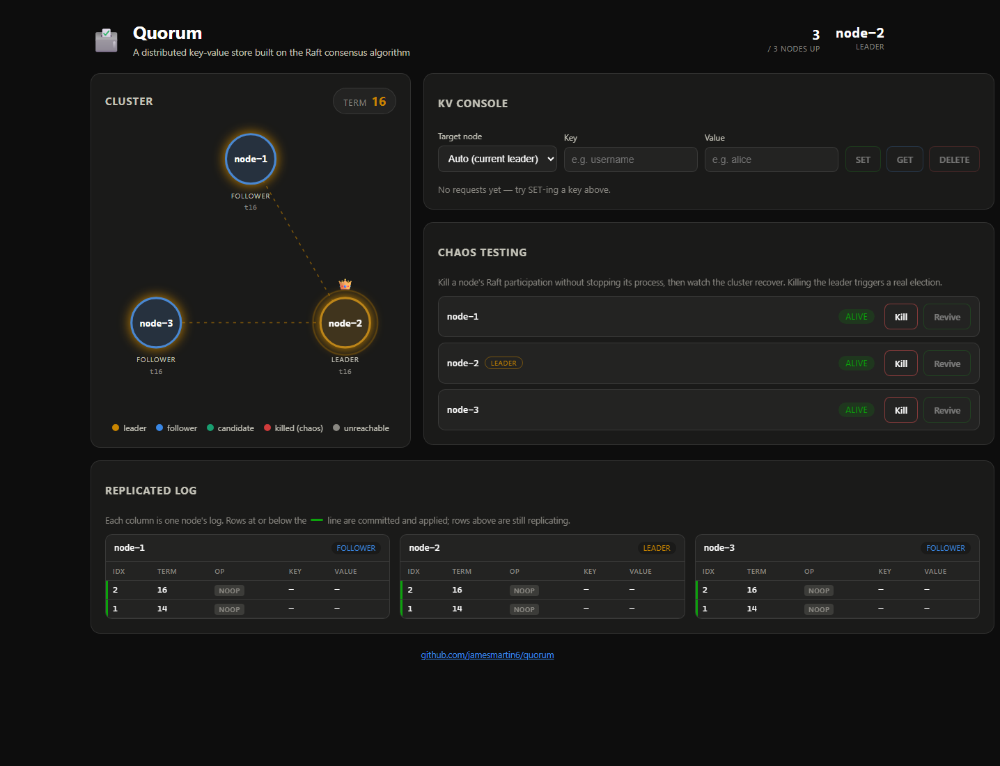
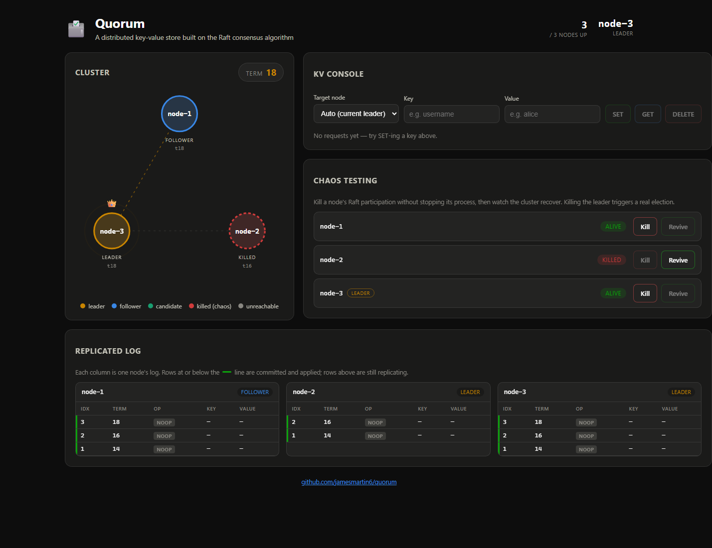
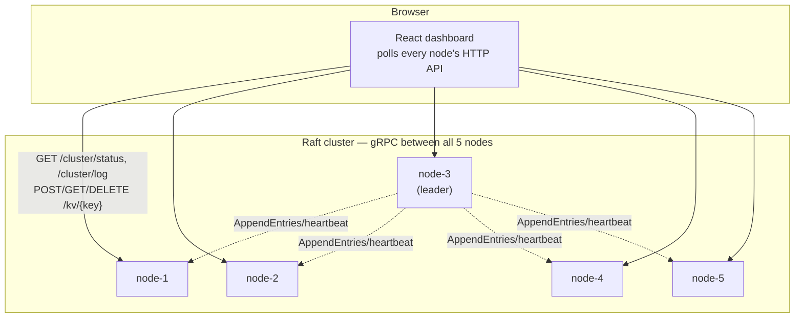

# Quorum

**A distributed key-value store built on the Raft consensus algorithm — with a live
dashboard that shows leader election, log replication, and failure recovery
actually happening, in real time.**

[](https://github.com/jamesmartin6/quorum/actions/workflows/ci.yml)
[](backend/go.mod)
[](LICENSE)

Kill the leader mid-write. Watch the survivors hold an election in under a
second. Revive it and watch it catch up. Nothing here is simulated —
every node is a real gRPC service running the actual Raft protocol, and the
dashboard is just watching it happen.



## What's actually going on here

Five independent Go processes, each running the Raft consensus algorithm and
talking to each other over gRPC, form a single replicated key-value store.
Write to any node and the command is only acknowledged once it's safely
committed — replicated to a majority of the cluster — so a promise that a
write succeeded is a promise it survives losing any two nodes. A React
dashboard polls every node directly and renders the cluster's actual state:
who's the leader, what term it is, what's in each node's log, and whether
each entry has committed yet.

The "Chaos Testing" panel isn't a mock — clicking **Kill** on the leader
really does stop that node from participating in the protocol. The
remaining nodes notice within one election timeout (150–300ms), hold a real
election, and the dashboard shows it happening: the killed node turns red,
a new leader gets the crown, and the replicated log keeps growing.



## Features

- **Real leader election** — randomized timeouts, term-based voting, split-vote
  resolution via retry, immediate step-down on seeing a higher term.
- **Real log replication** — the leader replicates entries in parallel, enforces
  the log-matching property, and only commits once a majority (including
  itself) has the entry. Followers that fall behind get repaired via a
  fast conflict-index backoff, not a decrement-and-retry loop.
- **Linearizable-ish reads** — reads and writes are only served by the current
  leader; every other node responds `503` with the current leader's address.
- **Crash-safe persistence** — term, vote, and log are written to disk before
  a node ever acknowledges an RPC that depends on them, so a restarted node
  picks up exactly where it left off.
- **A dashboard that isn't lying to you** — it's polling the real
  `/cluster/status` and `/cluster/log` endpoints on every node, not
  reading from a shared source of truth.
- **Chaos testing, live** — kill and revive any node's Raft participation
  from the UI and watch the cluster actually recover.

## Quickstart

```bash
git clone https://github.com/jamesmartin6/quorum.git
cd quorum
docker compose up --build
```

Then open **http://localhost:5173**. That's it — five Raft nodes and the
dashboard, from nothing.

Each node's HTTP API is also published directly, so you can poke at the
cluster yourself:

```bash
curl http://localhost:8081/cluster/status
curl -X POST http://localhost:8081/kv/hello -d '{"value":"world"}'
curl http://localhost:8081/kv/hello
```

To watch a *real* process death (not just the in-app chaos button):

```bash
docker kill quorum-node-1-1   # whichever container is currently the leader
```

## Architecture



Each node is the same binary (`backend/cmd/node`), configured entirely by
environment variables — which node it is, and who its peers are. Internally:

```
backend/internal/
├── raft/        core consensus state machine — election, replication,
│                persistence — with zero dependency on gRPC or HTTP. Unit
│                tests drive it through an in-memory Transport for fast,
│                deterministic runs.
├── rpc/         raft.proto + generated code, and the adapter that wires
│                the transport-agnostic raft.Raft onto real gRPC
├── kv/          the actual state machine: an in-memory map that only ever
│                changes by applying a committed log entry, in order
├── gateway/     the REST API clients and the dashboard talk to — leader
│                forwarding, chaos kill/revive, cluster status/log
└── cluster/     resolves one node's config (ID, ports, peers) from env vars
```

The frontend (`frontend/src`) is a small Vite + React app: `ClusterView`
renders the node graph and animates leader heartbeats, `KVConsole` is a
SET/GET/DELETE client with a request history, `LogViewer` shows every
node's log side-by-side with the commit line, and `ChaosControls` drives
the kill/revive endpoints. It polls rather than uses a WebSocket event
stream — simpler, and just as smooth at a 300ms refresh rate. See
[`progress.md`](progress.md) for the full log of engineering decisions and
the bugs that got fixed along the way.

## How the Raft implementation works

- **Election.** Every node starts as a Follower with a randomized 150–300ms
  election timeout. If it hears nothing from a leader in that window, it
  becomes a Candidate, votes for itself, and requests votes from every peer
  in parallel. It wins on a majority, loses (and steps down) if it sees a
  higher term, or times out and retries with a fresh random timeout — which
  is what resolves a split vote.
- **Replication.** A new leader immediately appends a no-op entry in its own
  term and replicates it. This matters: Raft only lets a leader *directly*
  commit entries from its own term, so without this trick a freshly elected
  leader could sit with a frozen commit index — even with a majority already
  holding every prior entry — until a client happened to write something.
  The no-op commits fast and drags everything before it along with it.
- **Safety.** Followers reject an `AppendEntries` unless the leader's view of
  the log up to that point matches their own (the log-matching property). On
  a mismatch they report back a conflict term/index so the leader can jump
  `nextIndex` straight to the right spot instead of retrying one entry at a
  time.
- **Persistence.** `currentTerm`, `votedFor`, and the full log are written to
  disk (atomically — write to a temp file, then rename) before a node
  responds to any RPC that changed them, so a crash never loses an
  acknowledged commitment.

## Local development (without Docker)

**Backend** — needs Go 1.23+, [protoc](https://protobuf.dev/) if you touch
`raft.proto`:

```bash
cd backend
go test ./... -race        # unit tests (in-memory transport) + integration
                            # tests (real gRPC over loopback)
go run ./cmd/node           # a single node; see internal/cluster for env vars
```

**Frontend** — needs Node 20+:

```bash
cd frontend
npm install
npm run dev                 # http://localhost:5173
# VITE_NODE_URLS=http://localhost:8081,... to point at a non-default cluster
```

## REST API (every node exposes the same surface)

| Method   | Path              | Description                                                  |
|----------|-------------------|----------------------------------------------------------------|
| `GET`    | `/cluster/status` | This node's role, term, leader, commit index, log length       |
| `GET`    | `/cluster/log`    | This node's full log                                           |
| `POST`   | `/kv/{key}`       | `{"value": "..."}` — leader only, `503` + leader address otherwise |
| `GET`    | `/kv/{key}`       | Leader only (linearizability), `503` + leader address otherwise |
| `DELETE` | `/kv/{key}`       | Leader only, `503` + leader address otherwise                  |
| `POST`   | `/chaos/kill`     | Stop this node's Raft participation (process keeps running)    |
| `POST`   | `/chaos/revive`   | Resume participation as a Follower                              |

## Testing

- `internal/raft` — unit tests against an in-memory `Transport`: election,
  re-election after a leader is killed, split-vote convergence, step-down on
  a higher term, log matching/truncation, the "Figure 8" commit-safety
  property, file-storage persistence round trips.
- `backend/test` — integration tests over **real gRPC** on loopback TCP:
  cluster formation and replication, a killed follower restarting and
  converging, and the scenario that actually matters —
  **kill the leader mid-write, verify no data loss, verify a new leader is
  elected.**
- `internal/gateway`, `internal/kv` — the REST surface and the state machine.
- `go test ./... -race` is clean across all of it.
- Frontend: `npm run lint`, `npm run build`.

CI runs all of the above on every push — see the badge at the top.

## License

[MIT](LICENSE)
